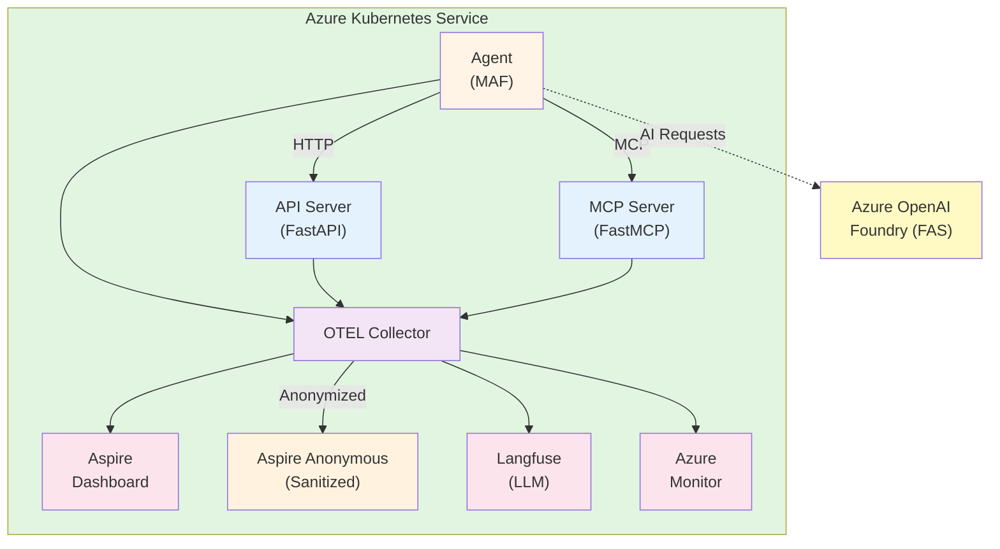

# Microsoft Agent Framework Observability Demo

Comprehensive observability for Microsoft Agent Framework (MAF) applications across different deployment scenarios and interaction patterns. This project demonstrates end-to-end telemetry collection from AI agents running in Azure Kubernetes Service with distributed tracing, metrics, and logs.

## 🎯 Demo Scenarios

| Scenario | Hosting | Agents | Status | Description |
|----------|---------|--------|--------|-------------|
| `local-maf` | Container | Single | ✅ | MAF with Azure OpenAI, accessing tools via API and MCP |
| `maf-with-fas` | Container | Single | ✅ | MAF with Foundry Agent Service, accessing tools via API and MCP |
| `local-maf-multiagent` | Container | Multi | ✅ | MAF with Magentic orchestration pattern (orchestrator + worker) |
| `maf-with-fas-multiagent` | Cloud | Multi | 🔄 | Planned: FAS-hosted multi-agent |
| `local-maf-with-fas-multiagent` | Hybrid | Multi | 🔄 | Planned: Local orchestrator + FAS worker |

## 🏗️ Architecture



**Key Components**:
- **Agent Container**: MAF with multiple scenarios, runs on-demand
- **MCP Server**: FastMCP-based function calling tools (stock lookup)
- **API Server**: FastAPI REST API (product information)
- **OTEL Stack**: Distributed tracing, metrics, and logs
- **Observability Platforms**: Aspire Dashboard, Langfuse, Azure Monitor

## 🚀 Quick Start Demo

### Prerequisites

- Azure subscription with appropriate permissions
- Terraform >= 1.5.0
- Azure CLI (logged in)
- kubectl configured
- Python 3.12+ with `uv` (for build scripts)

### 1️⃣ Deploy Infrastructure

```powershell
# Navigate to infrastructure directory
cd infra

# Copy and configure variables
cp terraform.tfvars.example terraform.tfvars
# Edit terraform.tfvars with your subscription_id, base_domain, and letsencrypt_email

# Initialize and deploy
terraform init
terraform apply
```

**Deployment includes**:
- AKS cluster with workload identity
- Azure AI Foundry with gpt-5-nano deployment
- Application Insights and Azure Monitor
- Langfuse for LLM observability
- NGINX ingress with Let's Encrypt SSL
- OTEL Collector and Aspire Dashboard

### 2️⃣ Build and Push Images

```powershell
# Navigate to scripts directory
cd ..\scripts

# Build and push all container images to ACR
uv run build_and_push.py
```

This builds three images: `agent`, `api-tool`, and `mcp-tool`, then updates Terraform with new version tags.

### 3️⃣ Deploy Updated Images

```powershell
# Return to infra directory
cd ..\infra

# Deploy new image versions via Helm
terraform apply
```

### 4️⃣ Run Agent Scenarios

Access the agent container and run scenarios interactively:

```powershell
# Get agent pod name
kubectl get pods -n maf-demo | Select-String "agent"

# Connect to agent container (replace <pod-name> with actual name)
kubectl exec -it -n maf-demo maf-demo-agent-<hash> -- /bin/bash

# Inside container - run specific scenario
uv run main.py -s local-maf              # Single agent with Azure OpenAI
uv run main.py -s maf-with-fas           # Single agent with Foundry Agent Service
uv run main.py -s local-maf-multiagent   # Multi-agent with Magentic orchestration

# Or run all scenarios sequentially
uv run main.py
```

**What happens**: Each scenario generates mock user context, executes agent workflow with tool calls, records telemetry (traces, metrics, logs), and outputs results to console.

### 5️⃣ Explore Observability

Retrieve access URLs and credentials:

```powershell
cd infra

# Aspire Dashboard (distributed tracing)
terraform output aspire_dashboard_url       # https://aspire.{your-domain}
# Also available: aspire-anon (no auth required)

# Langfuse (LLM observability)
terraform output langfuse_url               # https://langfuse.{your-domain}
terraform output langfuse_admin_email       # admin@maf-demo.local
terraform output -raw langfuse_admin_password

# Azure AI Foundry
terraform output ai_project_endpoint        # View in Azure Portal → AI Project → Tracing
```

**Aspire Dashboard**: View distributed traces across agent→API→MCP→Azure OpenAI, request flows, span durations, structured logs with correlation.

**Langfuse**: AI-specific traces with token counts, filter by:
- **Users**: user_001 through user_005 (3 VIP, 2 standard)
- **Sessions**: Conversation tracking by session_id
- **Scenarios**: Compare local-maf vs maf-with-fas vs local-maf-multiagent
- **Departments**: Engineering vs Marketing

**Azure AI Foundry**: Traces for `maf-with-fas` scenarios only (Foundry Agent Service managed agents), model performance metrics, token usage.

**Test endpoints**:
```powershell
$apiUrl = terraform output -raw api_tool_url
curl "$apiUrl/product-of-the-day"  # Generate test traces
```

## 📊 Demo User Structure

Scenarios use mock users for realistic telemetry:

| User ID | VIP Status | Department | Usage |
|---------|------------|------------|-------|
| user_001 | Yes | Engineering | High-priority requests |
| user_002 | Yes | Marketing | High-priority requests |
| user_003 | Yes | Engineering | High-priority requests |
| user_004 | No | Marketing | Standard requests |
| user_005 | No | Engineering | Standard requests |

**Telemetry Dimensions**:
- `user.id`: Randomly selected per run
- `user.roles`: VIP status (`["vip"]` or `[]`)
- `session.id`: Conversation thread identifier
- `organization.department`: Engineering or Marketing
- `scenario_id`: Which scenario is running (local-maf, maf-with-fas, etc.)
- `scenario_type`: single-agent or multi-agent

Filter and analyze by these dimensions in Langfuse and Aspire!

## 📚 Documentation

- **[Design Document](docs/DESIGN.md)** - Complete architecture, scenario matrix, telemetry strategy
- [Implementation Log](docs/IMPLEMENTATION_LOG.md) - Development history and decisions
- [Common Errors](docs/COMMON_ERRORS.md) - Troubleshooting guide
- Service READMEs: [Agent](src/agent/README.md) | [MCP Server](src/mcp_server/README.md) | [API Server](src/api_server/README.md)
- Infrastructure: [Terraform README](infra/README.md) | [Build Scripts](scripts/README.md)

## 🛠️ Technology Stack

- **Runtime**: Python 3.12+ with Microsoft Agent Framework
- **Agent Clients**: AzureOpenAIResponsesClient, AzureAIAgentClient
- **Instrumentation**: OpenTelemetry Python SDK
- **Infrastructure**: Terraform + Azure (AKS, ACR, AI Foundry)
- **Containerization**: Docker + Kubernetes
- **Package Management**: uv with pyproject.toml
- **API Framework**: FastAPI
- **Tool Protocol**: MCP (Model Context Protocol) via FastMCP
- **Observability**: Aspire Dashboard, Langfuse, Azure Monitor, Prometheus, Grafana

## 🔍 What You'll See

**In Aspire Dashboard**:
- Complete request traces from agent → API → MCP → Azure OpenAI
- Span durations and parent-child relationships
- Structured logs with context propagation
- Real-time telemetry as scenarios run

**In Langfuse**:
- AI-specific traces with token counts and costs
- User-based activity analysis (user_001-005)
- Session tracking across conversations
- Prompt/completion visibility
- Model performance metrics

**In Azure AI Foundry**:
- Foundry Agent Service execution traces
- Model deployment health and metrics
- Token usage and billing insights

## 🧹 Cleanup

Remove all deployed resources:

```powershell
cd infra
terraform destroy
```

## 🔧 Troubleshooting

**Pods not starting**: Check image pull status and resource limits
```powershell
kubectl describe pod -n maf-demo <pod-name>
kubectl logs -n maf-demo <pod-name>
```

**Certificates not ready**: Verify DNS records and Let's Encrypt status
```powershell
kubectl get certificates -A
kubectl describe certificate -n maf-demo <cert-name>
```

**No traces appearing**: Verify OTEL Collector connectivity
```powershell
kubectl logs -n maf-demo deployment/maf-demo-otel-collector
# Inside agent container:
curl http://maf-demo-otel-collector:4317
```

**Agent can't reach services**: Test internal DNS and service endpoints
```bash
# Inside agent container:
curl http://maf-demo-api-tool:8000/health
curl http://maf-demo-mcp-tool:8001/health
```

---

**Status**: Phase 2 - Multi-Agent Patterns (3 of 5 core scenarios implemented)  
**License**: MIT
