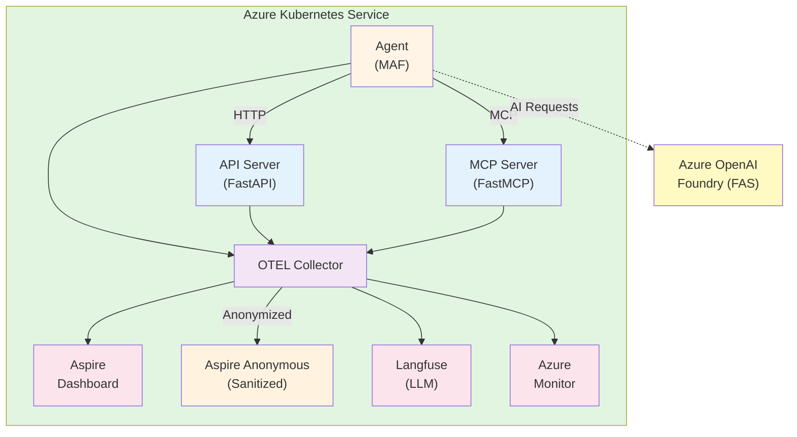

# Microsoft Agent Framework Observability Demo

End-to-end telemetry collection from AI agents running in Azure Kubernetes Service with distributed tracing, metrics, and logs.

## Demo Scenarios

| Scenario | Hosting | Agents | Status | Description |
|----------|---------|--------|--------|-------------|
| `local-maf` | Container | Single | ✅ | MAF with Azure OpenAI, accessing tools via API and MCP |
| `maf-with-fas` | Container | Single | ✅ | MAF with Foundry Agent Service, accessing tools via API and MCP |
| `local-maf-multiagent` | Container | Multi | ✅ | MAF with Magentic orchestration pattern (orchestrator + worker) |
| `maf-with-fas-multiagent` | Cloud | Multi | 🔄 | Planned: FAS-hosted multi-agent |
| `local-maf-with-fas-multiagent` | Hybrid | Multi | 🔄 | Planned: Local orchestrator + FAS worker |

## Architecture



## Quick Start

### Prerequisites

- Azure subscription, Terraform >= 1.5.0, Azure CLI (logged in), kubectl
- Python 3.12+ with `uv`

### 1. Deploy Infrastructure

```powershell
cd infra
cp terraform.tfvars.example terraform.tfvars
# Edit terraform.tfvars with your subscription_id, base_domain, and letsencrypt_email
terraform init && terraform apply
```

### 2. Build and Push Images

```powershell
cd ..\scripts
uv run build_and_push.py
```

### 3. Deploy Updated Images

```powershell
cd ..\infra
terraform apply
```

### 4. Run Agent Scenarios

```powershell
kubectl exec -it -n maf-demo $(kubectl get pods -n maf-demo -l app.kubernetes.io/component=agent -o jsonpath='{.items[0].metadata.name}') -- /bin/bash

# Inside the container:
uv run main.py -s local-maf              # Single agent with Azure OpenAI
uv run main.py -s maf-with-fas           # Single agent with Foundry Agent Service
uv run main.py -s local-maf-multiagent   # Multi-agent with Magentic orchestration
uv run main.py                           # Run all scenarios
```

### 5. Explore Observability

```powershell
cd infra
terraform output aspire_dashboard_url        # Aspire — distributed tracing
terraform output langfuse_url                # Langfuse — LLM observability
terraform output -raw langfuse_admin_password
terraform output ai_project_endpoint         # Azure AI Foundry — FAS traces
```

Quick test to generate traces:
```powershell
curl "$(terraform output -raw api_tool_url)/product-of-the-day"
```

## Documentation

- **[Design Document](docs/DESIGN.md)** — Architecture, scenario matrix, telemetry strategy, demo user structure
- [Implementation Log](docs/IMPLEMENTATION_LOG.md) — Development history and decisions
- [Common Errors](docs/COMMON_ERRORS.md) — Troubleshooting guide
- [Anonymized Observability](docs/ANONYMIZATION.md) — Privacy-preserving dashboard setup
- Service READMEs: [Agent](src/agent/README.md) | [MCP Server](src/mcp_server/README.md) | [API Server](src/api_server/README.md)
- Infrastructure: [Terraform](infra/README.md) | [Build Scripts](scripts/README.md)

## Cleanup & Troubleshooting

```powershell
# Tear down all resources
cd infra && terraform destroy
```

**Common diagnostics**:
```powershell
kubectl describe pod -n maf-demo <pod-name>          # Pod startup issues
kubectl logs -n maf-demo <pod-name>                   # Application logs
kubectl logs -n maf-demo deployment/maf-demo-otel-collector  # Missing traces
```

See [Common Errors](docs/COMMON_ERRORS.md) for detailed troubleshooting.

---

**License**: MIT
