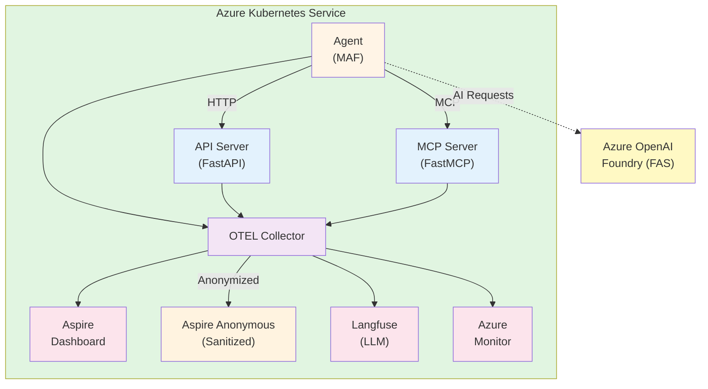

# Microsoft Agent Framework Observability Demo

End-to-end telemetry collection from AI agents running in Azure Kubernetes Service with distributed tracing, metrics, and logs.

## Demo Scenarios

| Scenario | Hosting | Agents | Status | Description |
|----------|---------|--------|--------|-------------|
| `local-maf` | Container | Single | ✅ | MAF with Azure OpenAI, accessing tools via API and MCP |
| `maf-with-fas` | Container | Single | ✅ | MAF with Foundry Agent Service, accessing tools via API and MCP |
| `local-maf-multiagent` | Container | Multi | ✅ | MAF with Magentic orchestration pattern (orchestrator + worker) |
| `maf-with-fas-multiagent` | Cloud | Multi | 🔄 | Planned: FAS-hosted multi-agent |
| `local-maf-with-fas-multiagent` | Hybrid | Multi | 🔄 | Planned: Local orchestrator + FAS worker |

## Architecture


```mermaid
graph TB
    subgraph AKS["Azure Kubernetes Service"]
        Agent["Agent<br/>(MAF)"]
        API["API Server<br/>(FastAPI)"]
        MCP["MCP Server<br/>(FastMCP)"]
        OTEL["OTEL Collector"]
        Aspire["Aspire<br/>Dashboard"]
        AspireAnon["Aspire Anonymous<br/>(Sanitized)"]
        Langfuse["Langfuse<br/>(LLM)"]
        Monitor["Azure<br/>Monitor"]
        
        Agent -->|HTTP| API
        Agent -->|MCP| MCP
        Agent --> OTEL
        API --> OTEL
        MCP --> OTEL
        OTEL --> Aspire
        OTEL -->|Anonymized| AspireAnon
        OTEL --> Langfuse
        OTEL --> Monitor
    end
    
    Foundry["Azure OpenAI<br/>Foundry (FAS)"]
    Agent -.->|AI Requests| Foundry
    
    style AKS fill:#e1f5e1
    style Agent fill:#fff4e6
    style API fill:#e3f2fd
    style MCP fill:#e3f2fd
    style OTEL fill:#f3e5f5
    style Aspire fill:#fce4ec
    style AspireAnon fill:#fff3e0
    style Langfuse fill:#fce4ec
    style Monitor fill:#fce4ec
    style Foundry fill:#fff9c4
```

## Quick Start

### Prerequisites

- Azure subscription, Terraform >= 1.5.0, Azure CLI (logged in), kubectl
- Python 3.12+ with `uv`
- A DNS zone you can edit for your chosen `base_domain` (for the checked-in config, `base_domain = "maf.tomasdemo.org"` so you need access to the `tomasdemo.org` zone)

### 1. Deploy Infrastructure

```powershell
cd infra
cp terraform.tfvars.example terraform.tfvars
# Edit terraform.tfvars with your subscription_id, base_domain, and letsencrypt_email
terraform init && terraform apply
```

### 2. Configure DNS for ingress

After the first `terraform apply`, point your public DNS records at the ingress public IP before testing the external URLs or waiting for Let's Encrypt certificates.

For the current checked-in config:

- `base_domain = "maf.tomasdemo.org"`
- Azure DNS zone: `tomasdemo.org`
- Required public hosts:
  - `api-tool.maf.tomasdemo.org`
  - `mcp-tool.maf.tomasdemo.org`
  - `aspire.maf.tomasdemo.org`
  - `aspire-anon.maf.tomasdemo.org`
  - `langfuse.maf.tomasdemo.org` when Langfuse is enabled

The simplest setup is to keep these two A records in the `tomasdemo.org` zone pointed at the current ingress IP:

- `maf`
- `*.maf`

Example:

```powershell
cd .\infra
$ingressIp = terraform output -raw ingress_public_ip_address
$ingressFqdn = terraform output -raw ingress_public_ip_fqdn

Write-Host "Ingress IP: $ingressIp"
Write-Host "Ingress FQDN: $ingressFqdn"

az network dns record-set a update `
  --resource-group rg-base `
  --zone-name tomasdemo.org `
  --name maf `
  --set "ARecords[0].ipv4Address=$ingressIp"

az network dns record-set a update `
  --resource-group rg-base `
  --zone-name tomasdemo.org `
  --name "*.maf" `
  --set "ARecords[0].ipv4Address=$ingressIp"
```

If the `maf` or `*.maf` record sets do not exist yet in your DNS zone, create them first and then point them at the same ingress IP.

If you prefer not to use a wildcard, create individual records for the hostnames above instead.

### 3. Build and Push Images

```powershell
cd .\scripts
uv run build_and_push.py
```

### 4. Deploy Updated Images

```powershell
cd ..\infra
terraform apply
```

### 5. Run Agent Scenarios

```powershell
az aks get-credentials --name mafobs-dev-aks --resource-group rg-maf-observability
kubectl exec -it -n maf-demo $(kubectl get pods -n maf-demo -l app.kubernetes.io/component=agent -o jsonpath='{.items[0].metadata.name}') -- /bin/bash

# Inside the container:
uv run main.py -s local-maf              # Single agent with Azure OpenAI
uv run main.py -s maf-with-fas           # Single agent with Foundry Agent Service
uv run main.py -s local-maf-multiagent   # Multi-agent with Magentic orchestration
uv run main.py                           # Run all scenarios
```

### 6. Explore Observability

```powershell
cd infra
terraform output aspire_dashboard_url        # Aspire — distributed tracing
terraform output langfuse_url                # Langfuse — LLM observability
terraform output -raw langfuse_admin_password
terraform output ai_project_endpoint         # Azure AI Foundry — FAS traces
```

Quick test to generate traces:
```powershell
curl "$(terraform output -raw api_tool_url)/product-of-the-day"
```

## Documentation

- **[Design Document](docs/DESIGN.md)** — Architecture, scenario matrix, telemetry strategy, demo user structure
- [Implementation Log](docs/IMPLEMENTATION_LOG.md) — Development history and decisions
- [Common Errors](docs/COMMON_ERRORS.md) — Troubleshooting guide
- [Anonymized Observability](docs/ANONYMIZATION.md) — Privacy-preserving dashboard setup
- Service READMEs: [Agent](src/agent/README.md) | [MCP Server](src/mcp_server/README.md) | [API Server](src/api_server/README.md)
- Infrastructure: [Terraform](infra/README.md) | [Build Scripts](scripts/README.md)

## Cleanup & Troubleshooting

```powershell
# Tear down all resources
cd infra && terraform destroy
```

**Common diagnostics**:
```powershell
kubectl describe pod -n maf-demo <pod-name>          # Pod startup issues
kubectl logs -n maf-demo <pod-name>                   # Application logs
kubectl logs -n maf-demo deployment/maf-demo-otel-collector  # Missing traces
```

See [Common Errors](docs/COMMON_ERRORS.md) for detailed troubleshooting.

---

**License**: MIT
